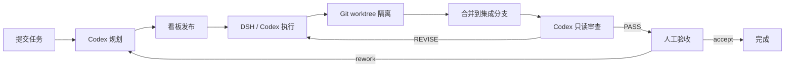

# dsh-taskflow

> DSH 全自动任务工作流插件：从提交任务到最终人工验收，全程可编排、可观察、可介入。

`dsh-taskflow` 是 DeepSeek Harness（DSH）生态中的一个插件。它将一个任务目标自动拆解为带验收标准与依赖关系的 Issue 列表，通过看板编排执行，并使用 Codex CLI 完成规划、实现与只读审查。人工只需要在关键节点（执行授权、最终验收）介入。

## 核心流程



1. **提交任务**：通过 `POST /plugins/taskflow/submit` 提交标题、描述和仓库路径。
2. **Codex 规划**：`CodexPlanner` 以只读、临时会话方式将任务拆分为多个 Issue；每个 Issue 包含验收标准（`acceptance`）、依赖（`deps`）和风险等级（`risk`）。
3. **看板发布**：通过 DAG 校验后的 Issue 进入五列看板：待办、进行中、待审查、已完成、失败。
4. **执行**：DSH 会话或内置 `CodexIssueExecutor` 认领 Issue；每个 Issue 在独立 Git worktree 中执行，成功后自动提交并合并到运行级集成分支。
5. **Codex 审查**：`CodexReviewer` 以只读方式审查集成 diff；`PASS` 进入人工验收，`REVISE` 携带结构化 findings 打回返工。
6. **人工验收**：通过 `POST /plugins/taskflow/human-decision` 选择 `accept` 通过，或 `rework` 回到规划阶段重新开始。

## 特性

- **全自动编排**：默认开启自动化，自动规划、自动执行、自动审查；也可切换为手动/半自动模式。
- **任务规划**：基于 Codex CLI 的结构化输出，生成带验收标准、依赖 DAG 和风险等级的 Issue 清单。
- **DAG 调度**：校验依赖关系、检测环，按拓扑序执行；支持 `maxConcurrent` 并行执行。
- **Git worktree 隔离**：每个 Issue 在独立 worktree 中实现，避免互相污染；成功改动统一合并到集成分支。
- **自动审查门禁**：Codex 只读审查集成 diff，通过后进入人工验收，不通过则带证据清单返工。
- **人工介入窗口**：支持执行前授权（`requireExecutionPermission`）、暂停/恢复/接管/重试/取消，以及最终人工验收。
- **持久化运行台账**：基于 storage-domain 持久化 Run 聚合、状态机、事件流，支持重启恢复。
- **浏览器运行台**：状态卡片、看板弹层、运行详情抽屉、SSE 实时事件和带二次确认的操作按钮。
- **team-board 联动**：可选将 taskflow 看板单向镜像到 team-board。

## 状态机

一个 Run 的典型生命周期：

```text
RECEIVED → PLANNING → READY → EXECUTING → INTEGRATION_REVIEW → AWAITING_HUMAN → ACCEPTED
```

同时支持以下分支状态：

- `WAITING_PERMISSION`：自动执行前等待人工放行。
- `WAITING_DECISION`：自动审查返工达到上限后等待人工决策。
- `PAUSED`：暂停执行。
- `FAILED`：执行失败，可重试。
- `CANCELLED`：取消。

## 环境要求

- 可运行的 DSH 环境（包含 web server 与 storage-domain）。
- Codex CLI 已安装并可通过 PATH 或 `CODEX_CLI_PATH` 访问。
- 当前内置规划器/执行器/审查器使用 `gpt-5.6-sol` 模型，需要对应的模型访问权限。
- Git（用于 worktree 隔离与集成分支合并）。
- Node.js 与 pnpm（开发/构建）。


## 安装

```sh
pnpm install
pnpm run check   # typecheck + test + build
```

在 DSH profile 中安装本地插件：

```sh
dsh plugin --profile web add /path/to/dsh-taskflow
```

## 配置

插件通过 DSH 的 Cordis 配置注入。常用配置项如下：

| 配置项 | 默认值 | 说明 |
| --- | --- | --- |
| `enabled` | `true` | 插件总开关 |
| `announceToAgent` | `true` | 是否向模型通告插件能力 |
| `allowedRepoRoots` | `[]` | 允许规划/执行的仓库根目录白名单；为空时禁用规划 |
| `codexCliPath` | `''` | Codex CLI 路径；为空时使用 `CODEX_CLI_PATH` 或系统 PATH |
| `maxConcurrent` | `1` | 最多同时执行的 Issue 数量 |
| `integrationBranch` | `taskflow/integration` | 集成分支名 |
| `worktreesRoot` | `.taskflow/worktrees` | worktree 根目录（相对仓库根） |
| `automationEnabled` | `true` | 是否启用自动化编排 |
| `autoPlan` | `true` | 自动化开启后是否自动规划 |
| `autoReview` | `true` | 自动化开启后是否自动触发 Codex 审查 |
| `maxExecutorProcesses` | `2` | 全局最大 Codex 执行进程数 |
| `maxReviewCycles` | `3` | 自动审查返工的最大轮数，超过后进入人工决策 |
| `requireExecutionPermission` | `false` | 自动执行前是否需要人工 `release` 放行 |
| `teamBoardSync` | `true` | 是否将看板镜像到 team-board |
| `teamBoardTaskPrefix` | `[taskflow]` | team-board 镜像任务的前缀 |
| `teamBoardOwner` | `''` | team-board 镜像任务的 owner |

如需完全手动模式，可设置：

```json
{
  "automationEnabled": false,
  "autoPlan": false,
  "autoReview": false
}
```

如需在自动规划后保留执行前人工授权：

```json
{
  "requireExecutionPermission": true
}
```

## HTTP API

所有写接口均要求同源 `application/json` POST，跨域写请求会被拒绝。

| Method | Path | 说明 |
| --- | --- | --- |
| GET | `/plugins/taskflow/state` | 运行台账快照 |
| GET | `/plugins/taskflow/status` | 插件与自动化状态 |
| GET | `/plugins/taskflow/board` | 五列看板快照 |
| GET | `/plugins/taskflow/run?runId=` | 运行详情投影（当前 Issue、允许动作、最近事件） |
| GET | `/plugins/taskflow/events?runId=` | SSE 实时事件流 |
| POST | `/plugins/taskflow/submit` | 创建任务 Run |
| POST | `/plugins/taskflow/command` | 控制动作：`cancel` / `pause` / `resume` / `takeover` / `release` / `retry` |
| POST | `/plugins/taskflow/delete` | 删除已结束/停滞的 Run |
| POST | `/plugins/taskflow/plan` | 触发 Codex 规划 |
| POST | `/plugins/taskflow/execute` | 启动/继续执行，认领可调度 Issue |
| POST | `/plugins/taskflow/exec-result` | 上报 Issue 执行结果 |
| POST | `/plugins/taskflow/progress` | 上报自动化执行进度 |
| POST | `/plugins/taskflow/review` | 触发 Codex 只读审查 |
| POST | `/plugins/taskflow/human-decision` | 人工验收：`accept` / `rework` |

## 与 team-board 联动

当同一 profile 安装了提供 `ctx.teamBoard` 服务的 team-board 插件时，taskflow 默认会将看板单向镜像到 team-board：

- taskflow 的待办/进行中/待审查/已完成/失败映射为 team-board 的 `todo` / `doing` / `doing` / `done` / `todo`。
- 镜像任务以 `[taskflow]` 前缀标识，重启后可幂等恢复。
- 可通过 `teamBoardSync=false` 关闭，或通过 `teamBoardTaskPrefix` / `teamBoardOwner` 调整识别前缀与 owner。

## Agent Skills

仓库内置了一套面向 DSH/Codex Agent 的 skill 指南，帮助模型正确操作 taskflow 插件。目录位于 `.agents/skills/`，与 DeepSeek Harness 的 skill 发现约定保持一致。

| Skill | 用途 |
| --- | --- |
| `dsh-taskflow` | 入口/路由，按用户目标选择对应 skill |
| `dsh-taskflow-submit-plan` | 提交任务、触发规划、处理 `READY` / `FAILED` |
| `dsh-taskflow-execute-monitor` | 认领 Issue、执行监控、上报结果/进度 |
| `dsh-taskflow-handle-review` | Codex 只读审查、`PASS` / `REVISE`、返工处理 |
| `dsh-taskflow-control-run` | 暂停/恢复/取消/接管/放行/重试/人工验收 |
| `dsh-taskflow-configure-automation` | 自动化/手动模式与并发/权限配置 |
| `dsh-taskflow-use-console` | 浏览器看板、运行台、SSE 与确认操作 |

如果你的 DSH 环境从本仓库加载 Agent skills，可以直接使用 `.agents/skills/` 目录；也可以将其中任意 skill 复制到目标环境的 `.agents/skills/` 目录。


## 开发

```sh
pnpm install
pnpm run typecheck
pnpm run test
pnpm run build
```

也可以一键执行全部检查：

```sh
pnpm run check
```

## 目录结构

- `src/index.ts` — 宿主入口：服务装配、系统提示词通告、HTTP 路由注册。
- `src/service.ts` — 核心编排服务：提交、规划、执行、审查、人工验收、控制命令、看板、事件流。
- `src/domain.ts` / `src/repository.ts` — Run 聚合持久化与原子读写。
- `src/state.ts` — Run 状态机与合法迁移表。
- `src/dag.ts` — Issue 计划校验与依赖拓扑排序。
- `src/planner.ts` — Codex CLI 规划执行器。
- `src/reviewer.ts` — Codex CLI 只读审查执行器。
- `src/executor.ts` / `src/issue-executor.ts` — 执行器接口与内置 Codex Issue Executor。
- `src/worktree.ts` — Git worktree 管理（建分支、合并、清理）。
- `src/contracts.ts` — 自动化执行器、控制动作、事件与配置契约。
- `src/team-board-sync.ts` — 可选 team-board 看板同步。
- `src/client/` — 浏览器端状态卡片、看板与运行台。
- `.agents/skills/` — 配套 DSH/Codex Agent skills（提交规划、执行监控、审查、控制、自动化配置、浏览器控制台）。
- `tests/` — 服务、状态机、DAG、规划器、持久化、执行引擎与 UI 测试。

## License

MIT
